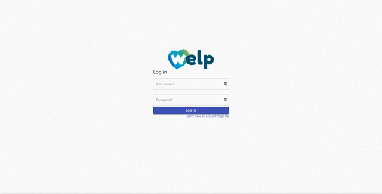

# 🗺️ Welcome to Welp 🗺️

This is a practice project that was born out of inspiration from Yelp. Users are able to click on locations on a map to see reviews left by other users; or they can leave a review if there's none. Users are able to like reviews left by other users and see/edit their own profiles.



## How to run

#### First, a note about HTTPS/SSL

This app relies on your browser location to render the initial view. Due to security reasons, modern browsers block location requests if HTTPS is not enabled. You can create and trust a self signed certificate or you can run the app without it, but it won't start in your approximate location.

- Click here for instructions on how to create a self-signed SSL certificate for [Linux](https://www.rosehosting.com/blog/how-to-generate-a-self-signed-ssl-certificate-on-linux/), [Windows](https://support.sophos.com/support/s/article/KB-000038223?language=en_US) and [Mac](https://support.apple.com/guide/keychain-access/create-self-signed-certificates-kyca8916/mac).

- Once you have a certificate (`.crt` and `.key`files), edit your `package.json` file and edit your start script:

  `HTTPS=true SSL_CRT_FILE=cert.crt SSL_KEY_FILE=cert.key npm start`

  Your browser will then complain about not trusting a self-signed certificate, just add it to your keyring and that's it. Alternatively, you can skip the certificate, but you will have to move the map to your location by yourself.

- Go to [mapbox.com](https://mapbox.com) and sign up for an account. After your account has been confirmed, you'll see an API key in the lower left box of your dashboard. Copy this API key for the next step.

- Set up the required environment variable. Depending on your system, you might have to edit either ~/.bashrc, /etc/profile, ~/.bash_profile, etc. and add:

  ```
  export REACT_APP_TOKEN='API key obtained in previous step'
  export REACT_APP_BASE_URL='http://localhost:3000'
  ```

- Install dependencies:

  `npm install`

- Run app:

  `npm start`

- If you haven't done so, check the [backend instructions](https://github.com/ThatJohn/welp-be).
